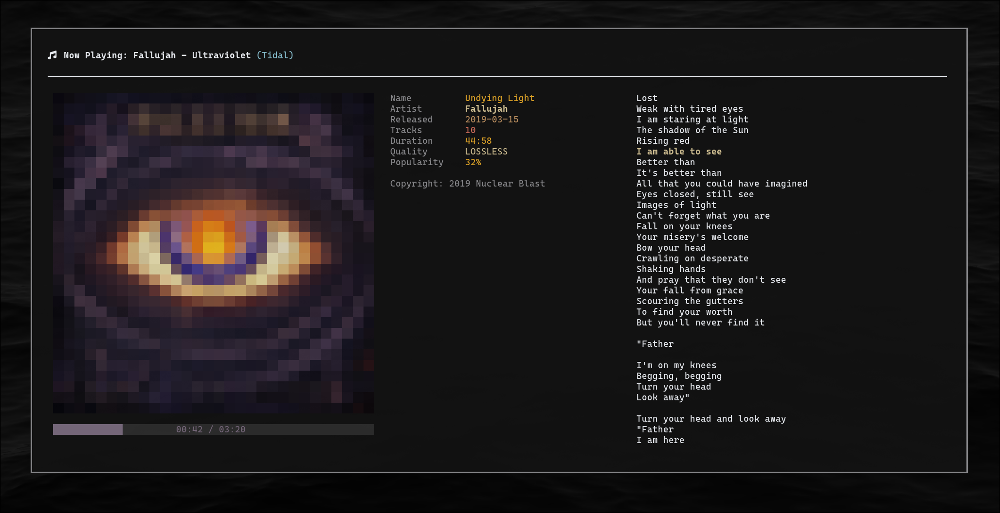

<h1 align="center">trackwatch</h1>

<p align="center">A beautiful terminal music visualizer with pixelated album art and synchronized lyrics</p>

<p align="center">
  <a href="https://github.com/estevaom/trackwatch/actions/workflows/ci.yml">
    
  </a>
  <a href="https://codecov.io/gh/estevaom/trackwatch">
    
  </a>
  <a href="https://opensource.org/licenses/MIT">
    
  </a>
  <a href="https://www.rust-lang.org">
    
  </a>
</p>

<p align="center">
  
</p>

---

## Features

- 🎵 **Universal Player Support** - Works with YouTube, Spotify, Tidal, VLC, and any MPRIS2-compatible player
- 🎨 **Pixelated Album Art** - 30x30 pixel art rendered with ANSI escape sequences (including YouTube video thumbnails!)
- 🌈 **Dynamic Color Theming** - Extracts colors from album art for UI elements
- 📝 **Synchronized Lyrics** - Auto-scrolling lyrics with LRC format support
- 💾 **Smart Caching** - Caches processed images and lyrics for performance
- ⚡ **Real-time Updates** - Live progress tracking and metadata updates

## Requirements

- Rust 1.70+
- `playerctl` (for media player detection)
- Terminal with 256 color support
- Tidal API credentials (for enhanced metadata)

## Installation

```bash
# Clone the repository
git clone https://github.com/estevaom/trackwatch
cd trackwatch

# Get Tidal API credentials from https://developer.tidal.com/dashboard/create
# Then set up environment variables
export TIDAL_CLIENT_ID=your_client_id
export TIDAL_CLIENT_SECRET=your_client_secret

# Build and run
cargo build --release
./target/release/trackwatch
```

### Controls

- `q` or `Esc` - Quit the application

## How It Works

1. **Player Detection**: Uses `playerctl` to monitor any MPRIS2-compatible media player
2. **Metadata Enrichment**: Fetches additional data from Tidal API when available
3. **Album Art Processing**: Downloads and converts images to 30x30 pixelated format
4. **Color Extraction**: Uses k-means clustering in LAB color space for palette generation
5. **Lyrics Fetching**: Downloads from LRCLIB API with intelligent caching
6. **UI Rendering**: Updates every 500ms with smooth animations and color transitions

## Architecture

- **Two-thread model**: Main thread for UI, background thread for data fetching
- **Shared state**: Thread-safe communication via `Arc<Mutex<App>>`
- **Hybrid async/sync**: Synchronous playerctl polling with async API calls
- **Graceful degradation**: Falls back to basic metadata when services unavailable

## Building from Source

```bash
# Development build
cargo build

# Run with debug output
RUST_LOG=debug cargo run

# Run tests
cargo test

# Generate documentation
cargo doc --open
```

## CI/CD

This project uses GitHub Actions for continuous integration and deployment:

### Automated Checks
- **Code Formatting**: Enforces consistent style with `cargo fmt`
- **Linting**: Catches common mistakes with `cargo clippy`
- **Testing**: Runs the full test suite (65+ tests)
- **Code Coverage**: Tracks test coverage with Codecov
- **Cross-platform Builds**: Builds for x86_64 and aarch64 Linux

### Release Process
The CI pipeline automatically:
1. Runs all quality checks on every push/PR
2. Generates code coverage reports
3. Creates release artifacts for multiple architectures
4. Caches dependencies for faster builds

### Running CI Locally
You can run the same checks locally before pushing:

```bash
# Format code
cargo fmt

# Run linter
cargo clippy -- -D warnings

# Run tests with coverage
cargo install cargo-tarpaulin
cargo tarpaulin --out Xml

# Build release binary
cargo build --release
```

## Configuration

The application uses environment variables:

```bash
# Required for Tidal metadata enrichment
TIDAL_CLIENT_ID=your_client_id
TIDAL_CLIENT_SECRET=your_client_secret

# Optional
RUST_LOG=debug  # Enable debug logging
```

## Cache Location

- Images: `~/.cache/trackwatch/`
- Lyrics: `~/.cache/trackwatch/lyrics/`

## License

MIT

## Acknowledgments

- [Ashish Kumar](https://github.com/ashish0kumar) ([@ash1sh0kumar](https://x.com/ash1sh0kumar)) for creating [mufetch](https://github.com/ashish0kumar/mufetch), the incredible terminal music visualizer that inspired this project. His work sparked the idea to build trackwatch and explore terminal-based media visualization.
- The Tidal API for media metadata
- The ratatui community for excellent TUI examples
- playerctl for universal media player support


<br>

<p align="center">
    
</p>

<p align="center">
    Made by <a href="https://github.com/estevaom">Estevao Machado</a>
</p>
